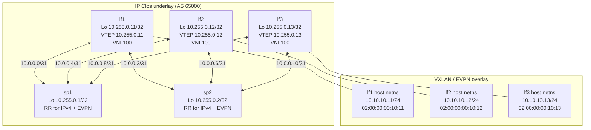

# EVPN Type-2 over IP Clos

This example builds a 2-spine / 3-leaf IP Clos underlay and then stretches one
L2 segment across the three leaves with EVPN type-2 over VXLAN.

`lab.yaml` does all of the following in one shot:

- Creates the Clos fabric with six /31 point-to-point links.
- Seeds BGP IPv4 unicast and BGP EVPN on all routers.
- Makes `sp1` and `sp2` act as route reflectors.
- Creates `br10` and `vxlan100` on each leaf.
- Creates one `host` namespace behind each leaf on `10.10.10.0/24`.
- Defines three `pings:` checks so the overlay can be verified with one command.

## Topology



## Bring It Up

Run on a Linux host:

```console
$ sudo frridge up -f examples/evpn_type2_over_ip_clos/lab.yaml
```

Or from macOS through Multipass:

```console
$ frridge-mp up \
    --repo-dir ~/src/frridge \
    --host-dir ~/src/frridge \
    --file examples/evpn_type2_over_ip_clos/lab.yaml
```

The example expects an image such as `frridge-frr:latest` that contains FRR,
`iproute2`, and `ping`.

## Verify It

Run all overlay ping checks defined in `lab.yaml`:

```console
$ sudo frridge ping -f examples/evpn_type2_over_ip_clos/lab.yaml
```

Run one check by name:

```console
$ sudo frridge ping -f examples/evpn_type2_over_ip_clos/lab.yaml lf1-host-to-lf2-host
```

Useful inspection commands:

```console
$ sudo frridge console lf1 -f examples/evpn_type2_over_ip_clos/lab.yaml
lf1# show bgp summary
lf1# show bgp l2vpn evpn summary
lf1# show bgp l2vpn evpn route type 2
lf1# show evpn vni
```

## Tear It Down

```console
$ sudo frridge down -f examples/evpn_type2_over_ip_clos/lab.yaml --purge
```
